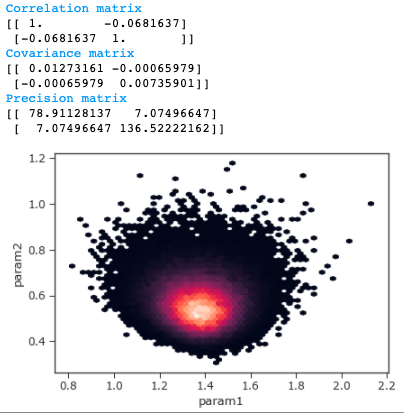
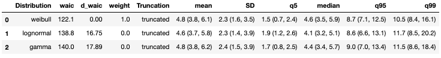
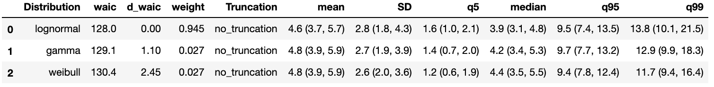
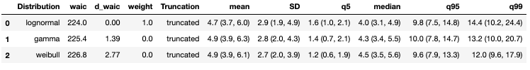
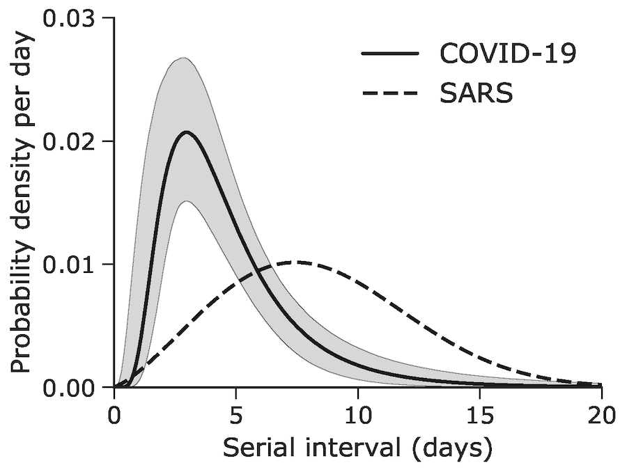
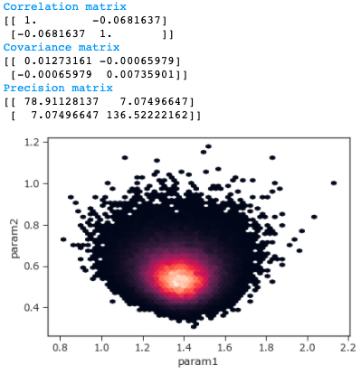
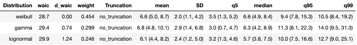

# Estimation of the serial interval of novel coronavirus (COVID-19) infections 

Supporting materials for Nishiura H, Linton NM, Akhmetzhanov AR 2020 "Serial interval of novel coronavirus (COVID-19) infections" International journal of infectious diseases 93: 284–6 ([doi:10.1016/j.ijid.2020.02.060](http://dx.doi.org/10.1016/j.ijid.2020.02.060))

## I. (certain pairs) Inference of the serial interval using only infector-infectee pairs identified from the literature with high certainty
* [A1. Stan simulations.ipynb](https://nbviewer.jupyter.org/github/aakhmetz/nCoVSerialInterval2020/blob/master/scripts/A1.%20Stan%20simulations.ipynb) Code to run MCMC simulations in cmdStan
* [A2. Processing the traces.ipynb](https://nbviewer.jupyter.org/github/aakhmetz/nCoVSerialInterval2020/blob/master/scripts/A2.%20Processing%20the%20traces.ipynb) Python script to analyse posterior distirubions generated by Stan
* If needed, the full output from Stan can be found in the shared [Dropbox folder](https://www.dropbox.com/sh/p34whc8kevdce89/AAAaBj7cTV4B5ID0mg2G7RG9a?dl=0) (size: 1.2Gb)

*Without truncation*

<p align="center">
  
</p>

*With right truncation*

<p align="center">
  
</p>

## II. (certain and probable pairs) Inference of the serial interval using only infector-infectee pairs identified as certain or probable
* [B1. Stan simulations including probable cases.ipynb](https://nbviewer.jupyter.org/github/aakhmetz/nCoVSerialInterval2020/blob/master/scripts/B1.%20Stan%20simulations%20including%20probable%20cases.ipynb) Code to run MCMC simulations in cmdStan
* [B2. Processing the traces for certain and probable cases.ipynb](https://nbviewer.jupyter.org/github/aakhmetz/nCoVSerialInterval2020/blob/master/scripts/B2.%20Processing%20the%20traces%20for%20certain%20and%20probable%20cases.ipynb) Python script to analyse posterior distirubions generated by Stan
* If needed, the full output from Stan can be found in the shared [Dropbox folder](https://www.dropbox.com/sh/qmiysl7jbv2hbp3/AACpeqP4wbtWiYd0uyhEyy7Pa?dl=0) (size: 2.0Gb)

*Without truncation*

<p align="center">
  
</p>

*With right truncation*

<p align="center">
  
</p>

## III. Output
* [C. Generating the figure.ipynb](https://nbviewer.jupyter.org/github/aakhmetz/nCoVSerialInterval2020/blob/master/scripts/C.%20Generating%20the%20figure.ipynb)


Lognormal distribution as the best-fit model for certain and probable pairs with right truncation
<p align="top">
  
</p>

Correlating between param1 (*meanlog*) and param2 (*sdlog*)
<p align="top">
  
</p>

## (complimentary) Initial analysis of six pairs from [[Li et al 2020 NEJM](https://www.nejm.org/doi/full/10.1056/NEJMoa2001316)]

We have also added our very initial analysis of six pairs from Li et al 2020 NEJM paper. Differently from the authors who implemented informative priors on the parameters as it was from SARS-CoV-1, we used weekly informative (standard) priors.
* [D1. Stan simulations for Li et al 2020 NEJM.ipynb](https://nbviewer.jupyter.org/github/aakhmetz/nCoVSerialInterval2020/blob/master/scripts/D1.%20Stan%20simulations%20for%20Li%20et%20al%202020%20NEJM.ipynb) Code to run MCMC simulations in cmdStan
* [D2. Processing the traces for Li et al 2020 NEJM.ipynb](https://nbviewer.jupyter.org/github/aakhmetz/nCoVSerialInterval2020/blob/master/scripts/D2.%20Processing%20the%20traces%20for%20Li%20et%20al%202020%20NEJM.ipynb) Python script to analyse posterior distirubions generated by Stan.

<p align="center">
  
</p>

The result of Li et al with informative prior was the gamma distribution with the mean 7.5 days (95% CI: 5.3, 19).

## Additional details
* The folder **data** contains the supplementary table used for our analysis.
* The folder **results** contains all constructed traceplots, as well as individual traces for the parameters of the distributions. As such, param1 & param2 in csv or pickle files are respectively the meanlog and sdlog for the lognormal distribution, the shape and inverse scale for the gamma distribution, and the shape and scale for the Weibull distribution. We followed the notation according to Stan manual (see the pages on [lognormal](https://mc-stan.org/docs/2_22/functions-reference/lognormal.html), [gamma](https://mc-stan.org/docs/2_22/functions-reference/gamma-distribution.html), and [Weibull](https://mc-stan.org/docs/2_22/functions-reference/weibull-distribution.html) distributions). The ```scipy.stats``` notation for each distribution follows the code: ```ss.lognorm(param2,scale=np.exp(param1))```, ```ss.gamma(param1,scale=1/param2)```, and ```ss.weibull_min(param1,scale=param2)```, respectively. Here ```ss``` and ```np``` are shortcuts for ```scipy.stats``` and ```numpy``` libraries in Python.
* Andrei R. Akhmetzhanov is grateful to [Chris Wymant](https://www.bdi.ox.ac.uk/Team/c-wymant) (University of Oxford, U.K.) for helpful exchange of emails regarding the statistical inference procedure and for pointing out that Li et al adopted an informative SARS prior in their work.


---------
**Thank you for your interest to our work!** 

Few words of caution: We would like to note that our code is not supposed to work out of box, because the links used in the notebooks were user-specific, and our main intent was to show the relevance of the methods used in our paper.
